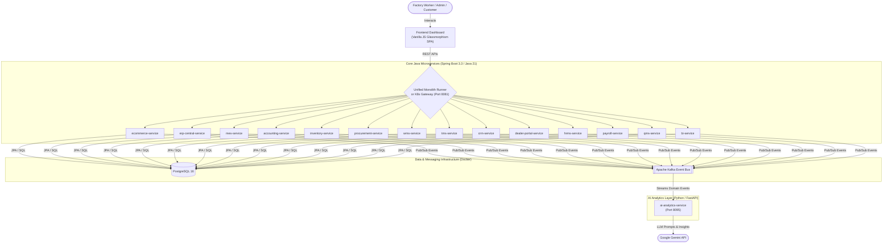

# Furniture Manufacturing Enterprise Resource Planning (ERP) Platform

[](https://www.oracle.com/java/)
[](https://spring.io/projects/spring-boot)
[](https://kafka.apache.org/)
[](https://www.postgresql.org/)
[](https://fastapi.tiangolo.com/)
[](https://ai.google.dev/)
[]()

A state-of-the-art Enterprise Resource Planning (ERP) platform architected for modern furniture manufacturing, retail (B2C), wholesale (B2B), warehouse logistics, plant operations, workforce payroll, and real-time AI-powered operational insights.

---

## 📑 Technical Documentation Library

*   📖 [**Documentation Master Index**](file:///C:/Users/datta/.gemini/antigravity/scratch/furniture-erp/docs/README.md)
*   🏗️ [**System Architecture & DDD Strategy**](file:///C:/Users/datta/.gemini/antigravity/scratch/furniture-erp/docs/detailed-architecture.md)
*   🔌 [**REST API Reference Manual**](file:///C:/Users/datta/.gemini/antigravity/scratch/furniture-erp/docs/api-reference.md)
*   ⚡ [**Event-Driven Messaging & Kafka Specification**](file:///C:/Users/datta/.gemini/antigravity/scratch/furniture-erp/docs/event-driven-messaging.md)
*   🗄️ [**Database Architecture & Schema Reference**](file:///C:/Users/datta/.gemini/antigravity/scratch/furniture-erp/docs/database-schema.md)
*   🧪 [**Comprehensive Testing & QA Strategy**](file:///C:/Users/datta/.gemini/antigravity/scratch/furniture-erp/docs/testing-guide.md)
*   🚀 [**Deployment & Operations Guide**](file:///C:/Users/datta/.gemini/antigravity/scratch/furniture-erp/docs/deployment-and-operations.md)
*   🖥️ [**Frontend Command Center Guide**](file:///C:/Users/datta/.gemini/antigravity/scratch/furniture-erp/docs/frontend-guide.md)
*   📋 [**Business Use Cases & Scenarios**](file:///C:/Users/datta/.gemini/antigravity/scratch/furniture-erp/docs/use-cases.md)

---

## 🏛️ Architecture Overview

The system implements a **Domain-Driven Design (DDD)** and **Event-Driven Architecture (EDA)** across 15 microservices:



---

## 📦 Microservices Catalog

| Service Module | Port | Responsibility & Domain Bounded Context |
| :--- | :--- | :--- |
| **`ecommerce-service`** | `8089` | Direct-to-Consumer (B2C) online furniture store, shopping cart, and payment event publishing. |
| **`erp-central-service`** | `8083` | Central sales order orchestration, order validation, and consolidation. |
| **`accounting-service`** | `8092` | General ledger double-entry bookkeeping, revenue/cost recognition, balance sheets. |
| **`mes-service`** | `8084` | Manufacturing Execution System: factory floor work orders, assembly line tracking. |
| **`inventory-service`** | `8081` | Real-time stock counts for raw timber, hardware, and finished furniture. |
| **`procurement-service`** | `8082` | Vendor purchase orders for lumber, fabrics, varnishes, and fittings. |
| **`wms-service`** | `8085` | Warehouse management: aisle, rack, and bin capacity tracking. |
| **`tms-service`** | `8086` | Transportation management: fleet dispatch, driver scheduling, and delivery routes. |
| **`crm-service`** | `8087` | Customer Relationship Management: client accounts, tier ratings, and loyalty scores. |
| **`dealer-portal-service`**| `8088` | B2B wholesale portal for commercial distributor orders. |
| **`hrms-service`** | `8090` | Human Resources: employee profiles and factory floor shift rosters. |
| **`payroll-service`** | `8091` | Employee payroll disbursement, tax deductions, and net salary slips. |
| **`qms-service`** | `8093` | Quality Management: inspection checklists, defect logging, and batch QA. |
| **`bi-service`** | `8094` | Business Intelligence: executive revenue and manufacturing KPI reports. |
| **`ai-analytics-service`** | `8095` | Real-time Kafka stream listener providing AI insights via Google Gemini. |
| **`erp-monolith-runner`** | `8081` | Single-process runner hosting all 14 Java modules (~1.5GB RAM) for development. |

---

## 🚀 Quick Start Guide

### 1. Prerequisites
*   JDK 21
*   Maven 3.8+
*   Docker & Docker Compose
*   Python 3.10+ (for AI service & test suites)

### 2. Configure Environment (`.env`)
```bash
GEMINI_API_KEY="your_gemini_api_key_here"
```

### 3. Build Application Code
```bash
mvn clean package -DskipTests
```

### 4. Start Docker Environment (Monolith Mode)
```bash
docker-compose up --build -d
```

### 5. Launch the Web UI
Open `furniture-erp-ui/index.html` in any web browser to access the Unified Command Center.

---

## 🧪 Testing Strategy & Verification

The codebase is backed by an automated multi-tier test suite across all 18 modules:

```bash
# 1. Full Build, Test & Install (Executes all 15+ Java Unit, Integration & Embedded E2E tests)
mvn clean install

# 2. Rapid Java Test Run (Runs all Java test suites without packaging)
mvn test

# 3. Test a Single Module (e.g. ecommerce-service)
mvn test -pl ecommerce-service

# 4. Run Python AI Analytics Unit Tests
python -m unittest discover -s ai-analytics-service/tests

# 5. Run Live End-to-End System Verification Suite (Real HTTP REST & Live Kafka sync against Docker)
python tests/live_e2e_suite.py
```

For full details, see the [Comprehensive Testing Guide](file:///C:/Users/datta/.gemini/antigravity/scratch/furniture-erp/docs/testing-guide.md).

