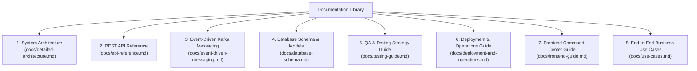

# Furniture ERP - Technical Documentation Index

Welcome to the comprehensive technical documentation library for the Furniture Manufacturing Enterprise Resource Planning (ERP) platform.

---

## Documentation Library

---

## Navigation & Quick Links

1.  [**Detailed Architecture & DDD Strategy**](file:///C:/Users/datta/.gemini/antigravity/scratch/furniture-erp/docs/detailed-architecture.md)  
    In-depth guide to Domain-Driven Design bounded contexts, service catalog, and architectural patterns.

2.  [**REST API Reference Manual**](file:///C:/Users/datta/.gemini/antigravity/scratch/furniture-erp/docs/api-reference.md)  
    Complete endpoints, request/response JSON schemas, error codes, and HTTP verbs for all 15 microservices.

3.  [**Event-Driven Messaging & Kafka Specification**](file:///C:/Users/datta/.gemini/antigravity/scratch/furniture-erp/docs/event-driven-messaging.md)  
    Kafka topic catalogs, JSON message schemas, consumer-producer matrices, and asynchronous lifecycle sequences.

4.  [**Database Schema & Models**](file:///C:/Users/datta/.gemini/antigravity/scratch/furniture-erp/docs/database-schema.md)  
    PostgreSQL table definitions, foreign keys, JPA entity mappings, and entity relationship diagrams.

5.  [**Testing Strategy & QA Guide**](file:///C:/Users/datta/.gemini/antigravity/scratch/furniture-erp/docs/testing-guide.md)  
    Unit testing, integration testing, embedded orchestration tests, and live test runner execution commands.

6.  [**Deployment & Operations Guide**](file:///C:/Users/datta/.gemini/antigravity/scratch/furniture-erp/docs/deployment-and-operations.md)  
    Docker Compose setup, environment variables, low-RAM monolith vs. distributed microservices, and troubleshooting.

7.  [**Frontend Command Center Guide**](file:///C:/Users/datta/.gemini/antigravity/scratch/furniture-erp/docs/frontend-guide.md)  
    Web application architecture, glassmorphism UI components, and end-to-end user navigation flows.

8.  [**Use Cases & Test Scenarios**](file:///C:/Users/datta/.gemini/antigravity/scratch/furniture-erp/docs/use-cases.md)  
    Real-world business process workflows from order placement to shipping and accounting ledger balancing.
