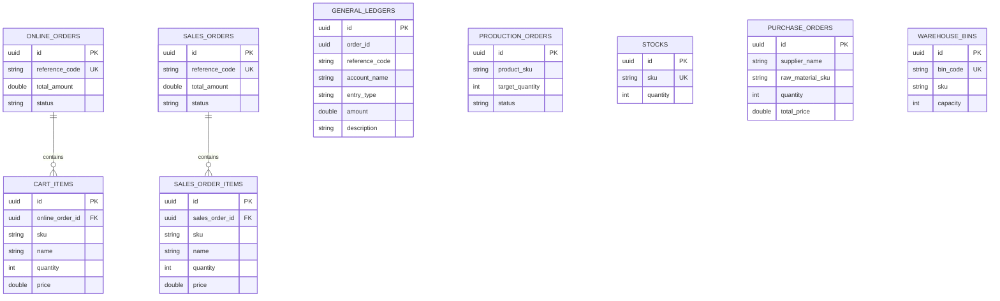

# Database Architecture & Schema Reference

The Furniture ERP persists all business domain records into **PostgreSQL**. Each microservice owns its own isolated domain tables, adhering strictly to Domain-Driven Design principles.

---

## 1. Entity Relationship Overview



---

## 2. Table Specifications

### 1. `online_orders` & `cart_items` (E-Commerce Domain)
Stores customer direct retail carts and payment statuses.

```sql
CREATE TABLE online_orders (
    id UUID PRIMARY KEY,
    reference_code VARCHAR(255) NOT NULL UNIQUE,
    total_amount DOUBLE PRECISION NOT NULL,
    status VARCHAR(50) NOT NULL
);

CREATE TABLE cart_items (
    id UUID PRIMARY KEY,
    online_order_id UUID REFERENCES online_orders(id) ON DELETE CASCADE,
    sku VARCHAR(100) NOT NULL,
    name VARCHAR(255),
    quantity INT NOT NULL,
    price DOUBLE PRECISION NOT NULL
);
```

---

### 2. `sales_orders` & `sales_order_items` (ERP Central Domain)
Official consolidated enterprise sales orders.

```sql
CREATE TABLE sales_orders (
    id UUID PRIMARY KEY,
    reference_code VARCHAR(255) NOT NULL UNIQUE,
    total_amount DOUBLE PRECISION NOT NULL,
    status VARCHAR(50) NOT NULL
);

CREATE TABLE sales_order_items (
    id UUID PRIMARY KEY,
    sales_order_id UUID REFERENCES sales_orders(id) ON DELETE CASCADE,
    sku VARCHAR(100) NOT NULL,
    name VARCHAR(255),
    quantity INT NOT NULL,
    price DOUBLE PRECISION NOT NULL
);
```

---

### 3. `general_ledgers` (Accounting Domain)
Double-entry bookkeeping financial ledger entries.

```sql
CREATE TABLE general_ledgers (
    id UUID PRIMARY KEY,
    order_id UUID,
    reference_code VARCHAR(255),
    account_name VARCHAR(100) NOT NULL,
    entry_type VARCHAR(20) NOT NULL, -- CREDIT or DEBIT
    amount DOUBLE PRECISION NOT NULL,
    description TEXT
);
```

---

### 4. `production_orders` (MES Domain)
Factory floor manufacturing work orders.

```sql
CREATE TABLE production_orders (
    id UUID PRIMARY KEY,
    product_sku VARCHAR(100) NOT NULL,
    target_quantity INT NOT NULL,
    status VARCHAR(50) NOT NULL -- PLANNED, IN_PROGRESS, COMPLETED
);
```

---

### 5. `stocks` (Inventory Domain)
Physical warehouse count of raw materials and finished goods.

```sql
CREATE TABLE stocks (
    id UUID PRIMARY KEY,
    sku VARCHAR(100) NOT NULL UNIQUE,
    quantity INT NOT NULL DEFAULT 0
);
```

---

### 6. `purchase_orders` (Procurement Domain)
External supplier timber, metal, and hardware orders.

```sql
CREATE TABLE purchase_orders (
    id UUID PRIMARY KEY,
    supplier_name VARCHAR(255) NOT NULL,
    raw_material_sku VARCHAR(100) NOT NULL,
    quantity INT NOT NULL,
    total_price DOUBLE PRECISION NOT NULL
);
```

---

### 7. `warehouse_bins` (WMS Domain)
Aisle and shelf bin mapping for warehouse inventory.

```sql
CREATE TABLE warehouse_bins (
    id UUID PRIMARY KEY,
    bin_code VARCHAR(100) NOT NULL UNIQUE,
    sku VARCHAR(100) NOT NULL,
    capacity INT NOT NULL
);
```

---

### 8. `delivery_routes` (TMS Domain)
Logistics shipping manifests, driver assignments, and vehicle registrations.

```sql
CREATE TABLE delivery_routes (
    id UUID PRIMARY KEY,
    origin VARCHAR(255) NOT NULL,
    destination VARCHAR(255) NOT NULL,
    vehicle_number VARCHAR(100) NOT NULL,
    driver_name VARCHAR(255) NOT NULL
);
```

---

### 9. `customer_profiles` (CRM Domain)
B2B & B2C customer profiles and customer relationship tiers.

```sql
CREATE TABLE customer_profiles (
    id UUID PRIMARY KEY,
    name VARCHAR(255) NOT NULL,
    email VARCHAR(255) NOT NULL UNIQUE,
    tier VARCHAR(50) NOT NULL, -- BRONZE, SILVER, GOLD, PLATINUM
    loyalty_score INT DEFAULT 0
);
```

---

### 10. `wholesale_orders` (Dealer Portal Domain)
Wholesale B2B store dealer orders.

```sql
CREATE TABLE wholesale_orders (
    id UUID PRIMARY KEY,
    dealer_id VARCHAR(100) NOT NULL,
    sku VARCHAR(100) NOT NULL,
    quantity INT NOT NULL,
    total_price DOUBLE PRECISION NOT NULL
);
```

---

### 11. `employee_records` & `salary_slips` (HRMS & Payroll Domains)
Factory floor and administrative workforce management.

```sql
CREATE TABLE employee_records (
    id UUID PRIMARY KEY,
    name VARCHAR(255) NOT NULL,
    department VARCHAR(100) NOT NULL,
    shift VARCHAR(50) NOT NULL,
    designation VARCHAR(100) NOT NULL
);

CREATE TABLE salary_slips (
    id UUID PRIMARY KEY,
    employee_id VARCHAR(100) NOT NULL,
    month_year VARCHAR(50) NOT NULL,
    base_salary DOUBLE PRECISION NOT NULL,
    deductions DOUBLE PRECISION NOT NULL
);
```

---

### 12. `quality_inspections` (QMS Domain)
QA defect tracking and lot certifications.

```sql
CREATE TABLE quality_inspections (
    id UUID PRIMARY KEY,
    product_sku VARCHAR(100) NOT NULL,
    passed BOOLEAN NOT NULL,
    inspector_name VARCHAR(255) NOT NULL,
    notes TEXT
);
```

---

### 13. `dashboard_reports` (BI Domain)
Aggregated executive analytics reports.

```sql
CREATE TABLE dashboard_reports (
    id UUID PRIMARY KEY,
    report_title VARCHAR(255) NOT NULL,
    total_revenue DOUBLE PRECISION NOT NULL,
    active_work_orders INT NOT NULL
);
```
