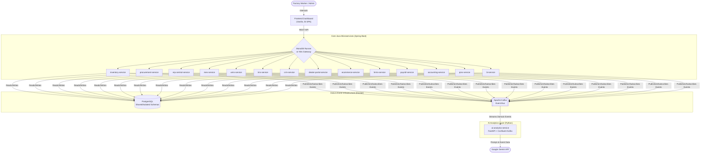
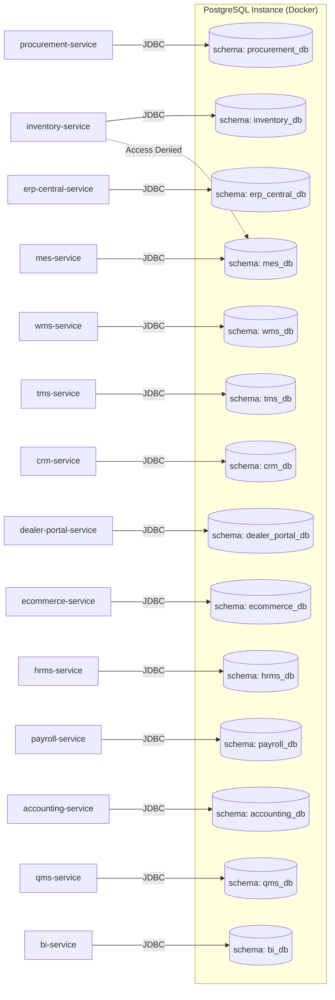
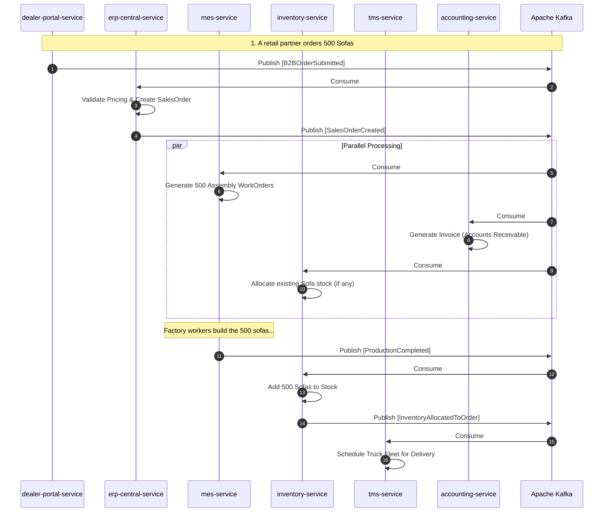

# Detailed System Architecture

While the high-level architecture diagram shows the conceptual flow, this document provides a comprehensive technical deep-dive into the entire Furniture ERP system.

## 1. High-Level System Architecture Diagram (Expanded)

## 1. Domain-Driven Design (DDD) Strategy
This ERP is strictly modeled using Domain-Driven Design. Instead of having a single massive database where tables are tangled together with foreign keys, the business is separated into **Bounded Contexts**.

Every microservice represents a Bounded Context. A microservice is the **only** entity allowed to read or write to its specific database tables. If the `mes-service` needs to know about an employee's shift, it cannot join the HR tables. It must consume an event from Kafka or make an API call to the `hrms-service`. This ensures that if the HR database schema changes, it doesn't break the manufacturing systems.

## 2. Comprehensive Service Catalog

The backend is composed of 14 distinct Java Spring Boot Microservices. Below is a detailed breakdown of their responsibilities and domains:

### Manufacturing & Operations
*   **`mes-service` (Manufacturing Execution System)**
    *   **Domain**: Factory floor operations.
    *   **Responsibilities**: Tracks `WorkOrders`, assembly line routing, and machine assignments. It consumes `SalesOrderCreated` events and plans the physical building of the furniture.
*   **`inventory-service` (Warehouse Stock)**
    *   **Domain**: Raw materials (wood, glue, screws) and Finished Goods (sofas, tables).
    *   **Responsibilities**: Maintains exact counts of physical inventory. Consumes events to deduct stock when manufacturing begins, and adds stock when purchasing receives shipments.
*   **`procurement-service` (Purchasing)**
    *   **Domain**: Vendor management and purchasing raw materials.
    *   **Responsibilities**: Issues `PurchaseOrders` to suppliers.
*   **`wms-service` (Warehouse Management System)**
    *   **Domain**: Physical warehouse layout.
    *   **Responsibilities**: Tracks the physical `BinLocation` of inventory. Ensures forklifts know exactly which aisle and shelf a pallet of wood is on.
*   **`qms-service` (Quality Management System)**
    *   **Domain**: Defect tracking and QA.
    *   **Responsibilities**: Schedules inspections for finished goods. Can pause shipments if items fail quality checks.

### Sales & Customers
*   **`erp-central-service` (Order Management)**
    *   **Domain**: The central nervous system for sales.
    *   **Responsibilities**: Converts leads and portal orders into official `SalesOrders`.
*   **`dealer-portal-service` (B2B)**
    *   **Domain**: Wholesale.
    *   **Responsibilities**: Provides a REST API for retail partners (like IKEA or Wayfair) to submit bulk orders.
*   **`ecommerce-service` (B2C)**
    *   **Domain**: Direct to consumer.
    *   **Responsibilities**: Handles single-item purchases from the public website, managing shopping carts and payment gateway integrations.
*   **`crm-service` (Customer Relationship)**
    *   **Domain**: Leads and support.
    *   **Responsibilities**: Tracks potential B2B clients, support tickets, and sales rep performance.

### Logistics & Finance
*   **`tms-service` (Transportation Management System)**
    *   **Domain**: Shipping and logistics.
    *   **Responsibilities**: Tracks truck fleets, calculates delivery routes, and monitors fuel usage.
*   **`accounting-service` (Finance)**
    *   **Domain**: General Ledger.
    *   **Responsibilities**: Manages Accounts Payable (paying vendors) and Accounts Receivable (collecting from dealers). It listens to almost all Kafka events to record financial impacts automatically.
*   **`bi-service` (Business Intelligence)**
    *   **Domain**: Data Warehousing.
    *   **Responsibilities**: A specialized service that aggregates data from Kafka to build historical reports (e.g., quarterly revenue, factory efficiency).

### Human Resources
*   **`hrms-service` (HR Management)**
    *   **Domain**: Employee records.
    *   **Responsibilities**: Manages employee onboarding, roles, and shift scheduling.
*   **`payroll-service` (Payroll)**
    *   **Domain**: Compensation.
    *   **Responsibilities**: Calculates salary, hourly wages for factory workers, and tax deductions.

---

## 3. The Shared Data Architecture

We utilize a **Database-per-Service** pattern (implemented via isolated schemas within a single Postgres instance to save costs). This guarantees loose coupling.

---

## 4. Comprehensive Event Flow Example

Here is a highly detailed look at how these 14 services interact using Kafka during a complex scenario: **A Bulk Order Fulfillment**.

## 5. Security & Gateway Layer (Keycloak)
Security is handled centrally by **Keycloak** (OpenID Connect / OAuth2).
1. When a user logs into the Frontend SPA, they authenticate with the Keycloak Docker container.
2. Keycloak issues a JWT (JSON Web Token).
3. The Frontend attaches this JWT as a `Bearer` token to all REST API calls.
4. The Spring Boot microservices intercept the request, validate the cryptographic signature of the JWT, and extract the user's roles (e.g., `ROLE_FACTORY_MANAGER`, `ROLE_ACCOUNTANT`) before allowing the action.
