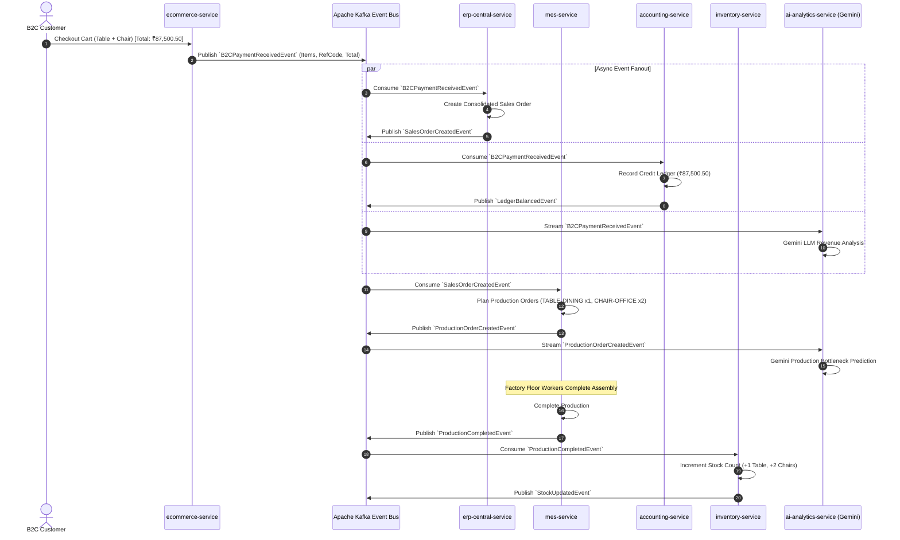

# Event-Driven Messaging & Kafka Specification

The Furniture ERP architecture relies on asynchronous event streaming over **Apache Kafka** to maintain eventual consistency between independently deployed microservice bounded contexts.

---

## 1. Event Propagation Flow



---

## 2. Topic & Producer/Consumer Matrix

| Topic Name | Producer Service | Consumer Service(s) | Payload Object | Purpose |
| :--- | :--- | :--- | :--- | :--- |
| `B2CPaymentReceivedEvent` | `ecommerce-service` | `erp-central-service`<br/>`accounting-service`<br/>`ai-analytics-service` | `B2CPaymentReceivedEvent` | Triggers sales order generation & ledger credit. |
| `SalesOrderCreatedEvent` | `erp-central-service` | `mes-service`<br/>`ai-analytics-service` | `SalesOrderCreatedEvent` | Notifies factory floor to plan production runs for each line item. |
| `LedgerBalancedEvent` | `accounting-service` | `bi-service` | `LedgerBalancedEvent` | Updates financial revenue metrics and executive KPIs. |
| `ProductionOrderCreatedEvent` | `mes-service` | `wms-service`<br/>`ai-analytics-service` | `ProductionOrderCreatedEvent` | Allocates raw material bins and initiates AI factory scheduling insights. |
| `ProductionCompletedEvent` | `mes-service` | `inventory-service`<br/>`qms-service` | `ProductionCompletedEvent` | Increments finished goods stock and schedules quality inspection. |
| `StockUpdatedEvent` | `inventory-service` | `bi-service` | `StockUpdatedEvent` | Real-time warehouse dashboard metric synchronization. |
| `QualityInspectionFailedEvent` | `qms-service` | `mes-service`<br/>`ai-analytics-service` | `QualityInspectionFailedEvent` | Halts delivery dispatch and triggers root-cause analysis. |
| `MaterialConsumptionRequestedEvent` | `mes-service` | `inventory-service`<br/>`ai-analytics-service` | `MaterialConsumptionRequestedEvent` | Reserves timber/metal stock for active factory builds. |

---

## 3. Event Payloads & JSON Schemas

### `B2CPaymentReceivedEvent`
Published when an e-commerce customer completes checkout:
```json
{
  "eventId": "18f94350-9c24-469b-819a-3d2319efb501",
  "aggregateId": "e7b0a880-9a3b-488b-a1bc-8cf0b4a7d6e1",
  "referenceCode": "ORD-B2C-20260802-001",
  "totalAmount": 87500.50,
  "currency": "INR",
  "items": [
    {
      "sku": "TABLE-DINING",
      "name": "Solid Oak Dining Table",
      "quantity": 1,
      "price": 62500.50
    },
    {
      "sku": "CHAIR-OFFICE",
      "name": "Ergonomic Mesh Chair",
      "quantity": 2,
      "price": 12500.00
    }
  ],
  "timestamp": 1785665000000
}
```

### `SalesOrderCreatedEvent`
Published when ERP Central validates and creates the consolidated sales order:
```json
{
  "eventId": "a98c0d12-4fb5-488a-9214-5d9c2409f871",
  "orderId": "e7b0a880-9a3b-488b-a1bc-8cf0b4a7d6e1",
  "referenceCode": "ORD-B2C-20260802-001",
  "totalAmount": 87500.50,
  "items": [
    {
      "sku": "TABLE-DINING",
      "name": "Solid Oak Dining Table",
      "quantity": 1,
      "price": 62500.50
    },
    {
      "sku": "CHAIR-OFFICE",
      "name": "Ergonomic Mesh Chair",
      "quantity": 2,
      "price": 12500.00
    }
  ],
  "timestamp": 1785665002000
}
```

### `ProductionCompletedEvent`
Published when MES factory floor completes production:
```json
{
  "eventId": "27f8a920-5f81-4bc9-93e1-382a9d80112c",
  "productionOrderId": "3505cf9b-e85d-4f7f-8367-9c98695079a0",
  "productSku": "CHAIR-OFFICE",
  "completedQuantity": 2,
  "timestamp": 1785665015000
}
```

---

## 4. Kafka Deserialization & Resilience Architecture

The system utilizes Spring Kafka consumers with a multi-layered deserialization wrapper:
1. **Direct POJO Binding**: Direct mapping when the exact typed class is shared via `common-domain`.
2. **Polymorphic Jackson Parser**: Handles raw JSON Strings, byte arrays, and Spring `ConsumerRecord` wrappers gracefully without throwing `MessageConversionException` or Jackson bean serialization failures.
3. **Idempotency**: All consumer handlers enforce deduplication via `orderId` / `referenceCode` to prevent duplicate ledger entries or duplicate work orders during Kafka partition rebalancing.
