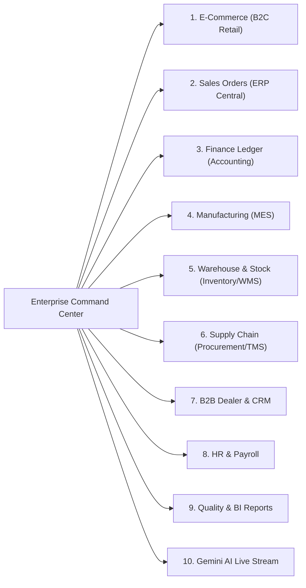

# Frontend Command Center & User Interface Guide

The Furniture ERP User Interface is a modern, responsive Single Page Application (SPA) designed with glassmorphism aesthetics, dynamic dark-mode styling, and real-time backend API integration.

---

## 1. UI Design & Tech Stack

*   **Structure & Logic**: Pure HTML5, Semantic CSS, and Vanilla JavaScript (ES6+).
*   **Aesthetics**: Glassmorphism (`backdrop-filter: blur(12px)`), dark gradients, vibrant accent colors, micro-animations, and responsive layouts.
*   **Currency**: Indian Rupee (`₹` / `INR`) across all product catalogs, cart summaries, and financial ledgers.
*   **Zero External Heavy Frameworks**: No heavy build step (like Webpack or Next.js required for simple client usage); can be opened directly or served over any static file server.

---

## 2. Command Center Tabs

---

## 3. Step-by-Step User Flow Walkthrough

### **Step 1: E-Commerce Multi-Item Shopping & Checkout**
1.  Navigate to the **E-Commerce** tab.
2.  Browse the catalog:
    *   **Solid Oak Dining Table** (`TABLE-DINING`): `₹62,500.50`
    *   **Ergonomic Mesh Chair** (`CHAIR-OFFICE`): `₹12,500.00`
    *   **Luxury King Size Bed** (`BED-KING`): `₹45,000.00`
3.  Click **Add to Cart** for multiple items (e.g., 1 Table + 2 Chairs).
4.  The Cart Badge and Cart Drawer dynamically update with line items, individual quantities, item subtotals, and total price (`₹87,500.50`).
5.  Click **Checkout & Pay**.
6.  The UI sends a `POST /api/v1/ecommerce/orders` request and receives the confirmed order ID and reference code (e.g. `CUST-ORDER-1785665000`).

---

### **Step 2: Verify ERP Central Sales Order**
1.  Navigate to the **Sales Orders (ERP)** tab.
2.  Click **Refresh** (or view the real-time list).
3.  A single **consolidated Sales Order** is displayed with matching total amount (`₹87,500.50`), status `CONFIRMED`, and both product line items listed.

---

### **Step 3: Verify Accounting General Ledger**
1.  Navigate to the **Finance Ledger** tab.
2.  Click **Refresh** (or search by Order Reference).
3.  A `CREDIT` transaction entry is displayed under account `REVENUE-B2C` for `₹87,500.50` with itemized item descriptions.

---

### **Step 4: Verify Factory Production in MES**
1.  Navigate to the **Manufacturing (MES)** tab.
2.  Separate production orders for each manufactured line item (e.g. `TABLE-DINING` and `CHAIR-OFFICE`) are generated automatically with status `PLANNED`.
3.  Click **Complete Production** on any work order.
4.  The status updates to `COMPLETED`, triggering inventory stock increment and quality inspection checks.

---

### **Step 5: View Gemini AI Insights**
1.  Navigate to the **AI Insights** tab.
2.  View real-time natural language analyses streamed from the Python AI microservice:
    *   Predictive bottleneck warnings
    *   Supply chain timber replenishment advice
    *   Revenue impact summaries
