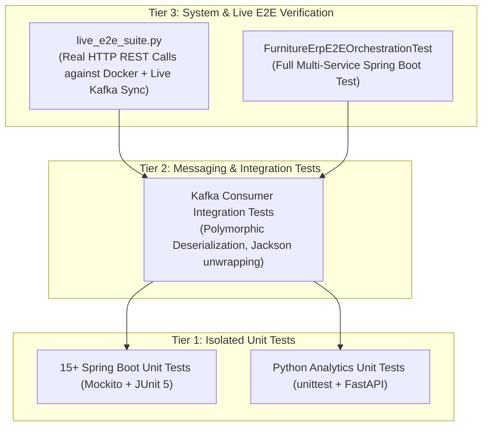

# Comprehensive Testing Guide & Quality Assurance Strategy

This guide details the test architecture, test classifications, execution commands, and verification procedures for the Furniture ERP system.

---

## 1. Test Architecture Layers

The testing pyramid for this enterprise application is divided into three tiers:



---

## 2. Test Execution & Build Lifecycle

### **Does `mvn clean install` automatically execute all test cases?**

> [!IMPORTANT]
> **YES.** In Maven, `install` is a downstream lifecycle phase:
> $$\text{validate} \longrightarrow \text{compile} \longrightarrow \mathbf{test} \longrightarrow \text{package} \longrightarrow \text{verify} \longrightarrow \mathbf{install}$$
> Running `mvn clean install` (or `mvn test`) will **automatically discover and execute all Java Unit Tests, Integration Tests, and Embedded E2E Tests** across all 18 reactor modules without needing to invoke them individually.

---

### **Test Scope Breakdown by Command**

| Command | Scope / Coverage | What Gets Executed |
| :--- | :--- | :--- |
| `mvn clean install` | **All Java Modules (Build + Test + Install)** | Compiles all 18 modules, executes all 15+ Java Unit Tests, Kafka Integration Tests, and the embedded `FurnitureErpE2EOrchestrationTest`, then installs JARs to local repository. |
| `mvn test` | **All Java Tests Only** | Rapidly compiles and runs all Java test suites without packaging or installing JARs. |
| `mvn test -pl <module>` | **Single Microservice Module** | Runs tests for one specific module (e.g. `mvn test -pl ecommerce-service`). |
| `mvn clean package -DskipTests` | **Build Without Tests** | Compiles and builds production `.jar` artifacts quickly by bypassing the test phase. |
| `python -m unittest discover -s ai-analytics-service/tests` | **Python AI Analytics Service** | Runs tests for the Python FastAPI microservice (managed outside Maven). |
| `python tests/live_e2e_suite.py` | **Live Running System (Black-box)** | Executes real HTTP REST calls against the live Docker container (`http://localhost:8081`) and validates real-time Kafka event propagation. |

---

## 3. Test Execution Commands Reference

### **A. Run All Java Tests (Automated Across All 18 Modules)**
```bash
# Option 1: Full clean, test, and install
mvn clean install

# Option 2: Run all tests quickly
mvn test
```
*Expected Result: `BUILD SUCCESS` across all 18 reactor modules with 0 failures and 0 errors.*

### **B. Run a Specific Microservice Test**
To run tests for a single microservice:
```bash
# E-Commerce Unit Tests
mvn test -pl ecommerce-service

# Accounting Unit & Integration Tests
mvn test -pl accounting-service

# MES Manufacturing Unit Tests
mvn test -pl mes-service

# ERP Central Sales Order Tests
mvn test -pl erp-central-service

# Monolith Embedded E2E Orchestration Test
mvn test -pl erp-monolith-runner
```

### **C. Run the Python AI Analytics Unit Tests**
Executes unit tests for the FastAPI AI service:
```bash
python -m unittest discover -s ai-analytics-service/tests
```
*Expected Output: `Ran 2 tests in 0.000s - OK`.*

### **D. Run the Live End-to-End System Verification Suite**
Verifies real-time synchronization on the live running Docker container (`http://localhost:8081`):
```bash
python tests/live_e2e_suite.py
```
*Expected Output:*
```
============================================================
  RUNNING LIVE END-TO-END VERIFICATION SUITE
============================================================
[TEST 1] E-Commerce Multi-Item Checkout...
  [PASS] E-Commerce order placed successfully with 2 items and total Rs. 87,500.50

[TEST 2] Verifying ERP Central Sales Order Sync...
  [PASS] ERP Central synchronized 1 consolidated Sales Order with 2 line items.

[TEST 3] Verifying Accounting Ledger Balance...
  [PASS] Accounting General Ledger verified: CREDIT entry for Rs. 87,500.50 recorded.

[TEST 4] Verifying MES Factory Production & Completion...
  [PASS] MES Production Order (CHAIR-OFFICE) completed successfully.

============================================================
  [SUCCESS] ALL LIVE E2E INTEGRATION & STATE CONSISTENCY TESTS PASSED!
============================================================
```

---

## 4. Test Catalog Details

### **Java Unit Tests Catalog**

| Module | Test File | Key Assertions & Validations |
| :--- | :--- | :--- |
| `ecommerce-service` | [OnlineOrderServiceTest.java](file:///C:/Users/datta/.gemini/antigravity/scratch/furniture-erp/ecommerce-service/src/test/java/com/furniture/erp/ecommerce/OnlineOrderServiceTest.java) | Multi-item cart calculation (`₹87,500.50`), item creation, event publishing. |
| `erp-central-service` | [SalesOrderServiceTest.java](file:///C:/Users/datta/.gemini/antigravity/scratch/furniture-erp/erp-central-service/src/test/java/com/furniture/erp/erpcentral/SalesOrderServiceTest.java) | Consolidated multi-line Sales Order creation, event publishing. |
| `accounting-service` | [GeneralLedgerServiceTest.java](file:///C:/Users/datta/.gemini/antigravity/scratch/furniture-erp/accounting-service/src/test/java/com/furniture/erp/accounting/GeneralLedgerServiceTest.java) | Double-entry ledger validation, credit amount match. |
| `mes-service` | [MesServiceTest.java](file:///C:/Users/datta/.gemini/antigravity/scratch/furniture-erp/mes-service/src/test/java/com/furniture/erp/mes/MesServiceTest.java) | Production order creation, status transitions (`PLANNED` $\rightarrow$ `COMPLETED`). |
| `inventory-service` | [InventoryServiceTest.java](file:///C:/Users/datta/.gemini/antigravity/scratch/furniture-erp/inventory-service/src/test/java/com/furniture/erp/inventory/InventoryServiceTest.java) | Stock creation, quantity updates, reservation checks. |
| `procurement-service` | [PurchaseOrderServiceTest.java](file:///C:/Users/datta/.gemini/antigravity/scratch/furniture-erp/procurement-service/src/test/java/com/furniture/erp/procurement/PurchaseOrderServiceTest.java) | Purchase order generation, supplier cost verification. |
| `wms-service` | [WarehouseBinServiceTest.java](file:///C:/Users/datta/.gemini/antigravity/scratch/furniture-erp/wms-service/src/test/java/com/furniture/erp/wms/WarehouseBinServiceTest.java) | Bin capacity allocation and occupancy tracking. |
| `tms-service` | [DeliveryRouteServiceTest.java](file:///C:/Users/datta/.gemini/antigravity/scratch/furniture-erp/tms-service/src/test/java/com/furniture/erp/tms/DeliveryRouteServiceTest.java) | Delivery route scheduling, vehicle & driver assignment. |
| `crm-service` | [CustomerProfileServiceTest.java](file:///C:/Users/datta/.gemini/antigravity/scratch/furniture-erp/crm-service/src/test/java/com/furniture/erp/crm/CustomerProfileServiceTest.java) | Customer profile registration, tier assignment. |
| `dealer-portal-service`| [WholesaleOrderServiceTest.java](file:///C:/Users/datta/.gemini/antigravity/scratch/furniture-erp/dealer-portal-service/src/test/java/com/furniture/erp/dealerportal/WholesaleOrderServiceTest.java) | B2B wholesale order processing and total price checks. |
| `hrms-service` | [EmployeeRecordServiceTest.java](file:///C:/Users/datta/.gemini/antigravity/scratch/furniture-erp/hrms-service/src/test/java/com/furniture/erp/hrms/EmployeeRecordServiceTest.java) | Employee profile creation, department assignment. |
| `payroll-service` | [SalarySlipServiceTest.java](file:///C:/Users/datta/.gemini/antigravity/scratch/furniture-erp/payroll-service/src/test/java/com/furniture/erp/payroll/SalarySlipServiceTest.java) | Salary slip calculation, tax deduction verification. |
| `qms-service` | [QualityInspectionServiceTest.java](file:///C:/Users/datta/.gemini/antigravity/scratch/furniture-erp/qms-service/src/test/java/com/furniture/erp/qms/QualityInspectionServiceTest.java) | QA inspection status logging and notes persistence. |
| `bi-service` | [DashboardReportServiceTest.java](file:///C:/Users/datta/.gemini/antigravity/scratch/furniture-erp/bi-service/src/test/java/com/furniture/erp/bi/DashboardReportServiceTest.java) | Executive KPI report aggregation. |
| `ai-analytics-service` | [test_analytics.py](file:///C:/Users/datta/.gemini/antigravity/scratch/furniture-erp/ai-analytics-service/tests/test_analytics.py) | Python FastAPI `/health` and `/analyze` prompt handling. |

### **Integration Tests Catalog**

| Test File | Target Consumer | Validation |
| :--- | :--- | :--- |
| [AccountingKafkaConsumerIntegrationTest.java](file:///C:/Users/datta/.gemini/antigravity/scratch/furniture-erp/accounting-service/src/test/java/com/furniture/erp/accounting/AccountingKafkaConsumerIntegrationTest.java) | `AccountingKafkaConsumer` | Deserialization of multi-item `B2CPaymentReceivedEvent` into General Ledger entry. |
| `ErpCentralKafkaConsumer` | `ErpCentralKafkaConsumer` | Deserialization of `B2CPaymentReceivedEvent` into consolidated multi-line Sales Order. |
| `MesKafkaConsumer` | `MesKafkaConsumer` | Deserialization of `SalesOrderCreatedEvent` into discrete factory floor production orders. |

### **End-to-End Orchestration Tests**
*   [FurnitureErpE2EOrchestrationTest.java](file:///C:/Users/datta/.gemini/antigravity/scratch/furniture-erp/erp-monolith-runner/src/test/java/com/furniture/erp/runner/FurnitureErpE2EOrchestrationTest.java): Complete embedded Spring Boot test validating the full multi-tier flow from checkout to inventory update.
*   [live_e2e_suite.py](file:///C:/Users/datta/.gemini/antigravity/scratch/furniture-erp/tests/live_e2e_suite.py): Automated black-box integration test executing real HTTP requests and validating cross-domain state propagation.
