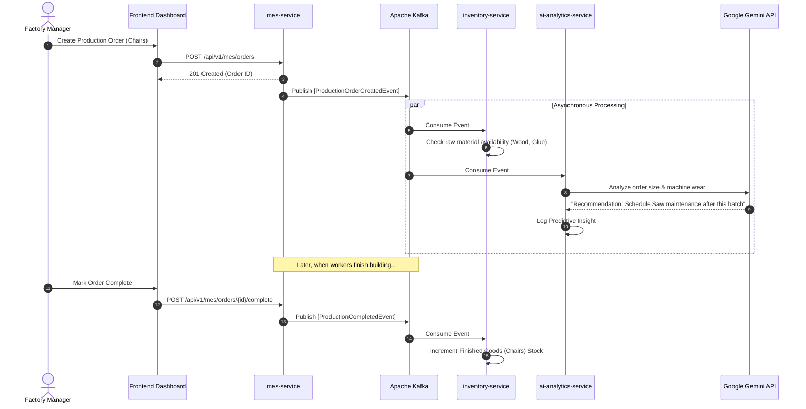
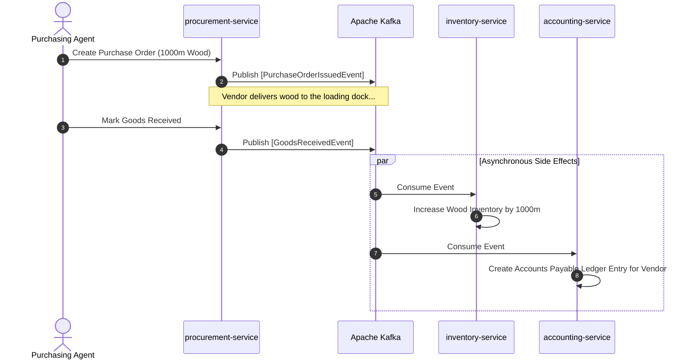
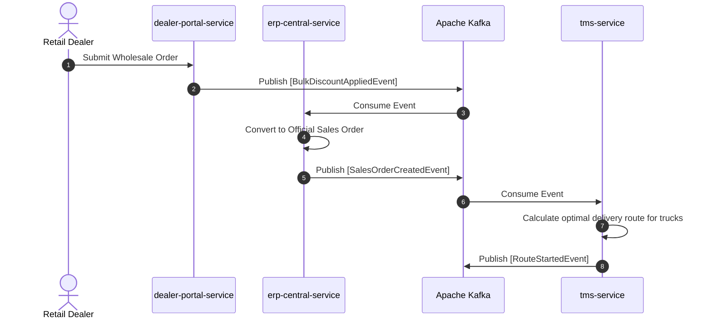

# Business Use Cases & Flows

Because the Furniture ERP is built on an Event-Driven Architecture, complex business processes are choreographed asynchronously. Below are the flow diagrams for critical business use cases.

## 1. The Manufacturing Execution Flow

**Scenario**: A factory manager decides to manufacture a batch of wooden chairs.

## 2. The Procurement & Inventory Flow

**Scenario**: The factory runs low on raw materials and purchases from a vendor.

## 3. The B2B Sales Fulfillment Flow

**Scenario**: A retail store bulk-orders furniture through the Dealer Portal.

